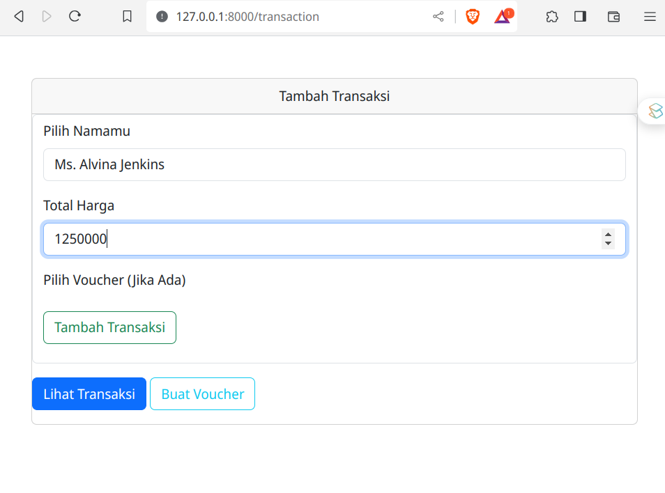
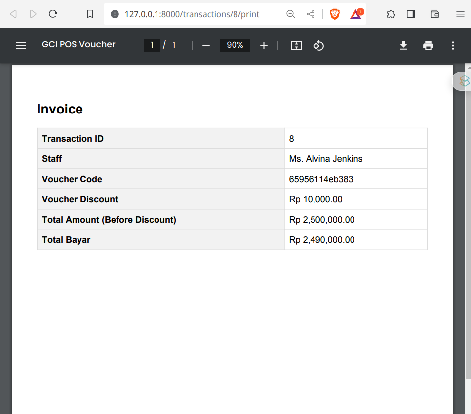

## Tentang Project

Project Ini aplikasi web sederhana untuk menyelesaikan test GCI Intern yaitu membuat sebuah perhitungan voucher yang akan bisa dipakai apabila jumlah total mencapai atau lebih dari 2 juta dengan potongan harga menjadi 10 ribu.

## Design Database

Database memiliki 3 table yaitu :

- Staff
- Transactions
- Vouchers

Dengan relasi table staff memiliki banyak transaction dan transaction memiliki 1 voucher.

## Contoh Demo

Berikut beberapa contoh aplikasi webnya saat dijalankan:

- Mengenerate voucher asumsinya kita sebagai staff, kita generate vocuher untuk expired dalam waktu 3 bulan.
- 
- Dibawah list dari voucher yang telah digenerate dan siap pakai dalam kurun 3 bulan kedepan.
- 
- Voucher dapat digunakan apabila total yang dihitung mencapai 2 juta atau lebih, dan jika tidak sampai maka vocuher tidak akan bisa dipakai.
- 
- 
- Ketika berhasil dipakai maka jumlah yang harus dibayar akan berkurang sebanyak 10 ribu.
- 
- Dan saat mencetak faktur kode dan harga yang dipotong dari voucher akan tampil.
- 

## License

The Laravel framework is open-sourced software licensed under the [MIT license](https://opensource.org/licenses/MIT).
